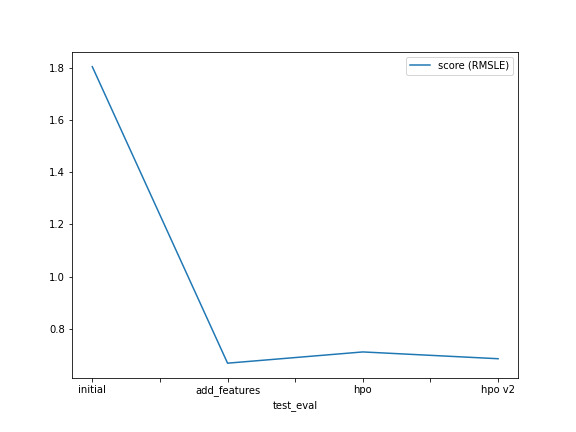

# Report: Predict Bike Sharing Demand with AutoGluon Solution
#### Camila González Williamson

## Initial Training
### What did you realize when you tried to submit your predictions? What changes were needed to the output of the predictor to submit your results?
I was expecting the resulting predictions to contain negative values for the predicted counts, but actually all the counts were positive and the distribution looked similar to the one in the training set.

### What was the top ranked model that performed?
The best model was `WeightedEnsemble_L3`, which is a combination of different models.

## Exploratory data analysis and feature creation
### What did the exploratory analysis find and how did you add additional features?
In the exploratory analysis it was found that the counts exhibited an hourly seasonality.

### How much better did your model preform after adding additional features and why do you think that is?
I added the hour, and the Root Mean Squared Logarithmic Error (RMSLE) went from `1.80335` to `0.66925`. The feature `hour` has a good explanatory power for the `counts`.

## Hyper parameter tuning
### How much better did your model preform after trying different hyper parameters?
Actually the first time I tried tunning hyperparameters the model got worse. I followed the advice of given in [AutoGluon's documentation](https://auto.gluon.ai/dev/tutorials/tabular_prediction/tabular-indepth.html) and the performance degraded from  `0.66925` to `0.71223`
However, I did a second adjustment based on the previous parameters, and after that the performance slightly improved from `0.66925` to `0.68627`.

### If you were given more time with this dataset, where do you think you would spend more time?
I would spend more time on feature engineering.

### Create a table with the models you ran, the hyperparameters modified, and the kaggle score.
|model|hpo1|hpo2|hpo3|score (RMSLE)|
|--|--|--|--|--|
|initial|1|8|20|1.80335|
|add_features|1|8|20|0.66925|
|hpo|3|7|1|0.71223|
|hpo v2|3|9|30|0.68627|

### Create a line plot showing the top model score for the three (or more) training runs during the project.

### Create a line plot showing the top kaggle score for the three (or more) prediction submissions during the project.

## Summary
In this exercise we used AutoGluon to predict the Bike Sharing Demand. We noticed the huge improvement that feature engineering brought to the problem. Hyperparameter tunning helped as well to slightly improve the model, but it was not as effective as feature engineering.

